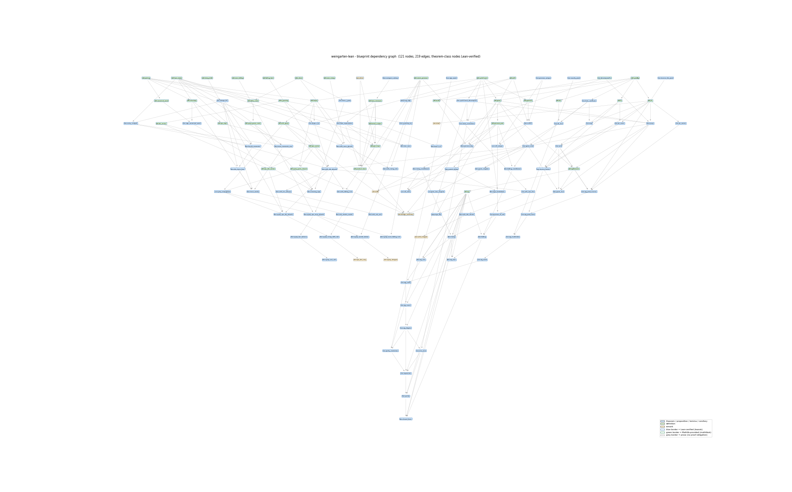

# Blueprint artifacts

Local, committed renderings of the project blueprint, so the mathematical write-up
and its dependency structure are available **without** building the GitHub Pages
site. The source of truth is `blueprint/src/content.tex`; these are generated from it.

- **[blueprint.pdf](blueprint.pdf)** — the full blueprint: paper proofs, definitions,
  and the per-node Lean correspondence, compiled from `blueprint/src/`.
- **[dependency_graph.pdf](dependency_graph.pdf)** — the theorem dependency graph
  (132 nodes, 239 edges), laid out by longest-path depth. The PDF is vector — zoom
  for the node labels. A raster preview is below.

Node **fill** encodes the kind (theorem / proposition / lemma / corollary, definition,
remark); the **border** encodes status: blue = Lean-verified (`\leanok`), green =
Mathlib-provided (`\mathlibok`), grey = prose remark (no proof obligation).



## Regenerating

```sh
# Blueprint PDF — needs a unicode-math LaTeX engine (xelatex or lualatex);
# run three times so cross-references and the table of contents settle.
cd blueprint/src
xelatex -interaction=nonstopmode print.tex
xelatex -interaction=nonstopmode print.tex
xelatex -interaction=nonstopmode print.tex
# then copy blueprint/src/print.pdf -> docs/blueprint.pdf

# Dependency graph — needs Python with networkx + matplotlib (standard library otherwise).
python scripts/gen_dep_graph.py
```

The interactive web blueprint — with the live, clickable dependency graph — is the
eventual **GitHub Pages** target; the `blueprint/src/` sources are kept ready for it. (The committed
`.github/workflows/blueprint.yml` gates every push on the kernel build, the axiom
audit (`scripts/AxiomsAudit.lean`), the blueprint-to-code correspondence
(`checkdecls` over `blueprint/lean_decls`), and the exact-arithmetic suites
(`scripts/verify_all.py`); blueprint regeneration and Pages deployment are
deliberately not part of CI.)
